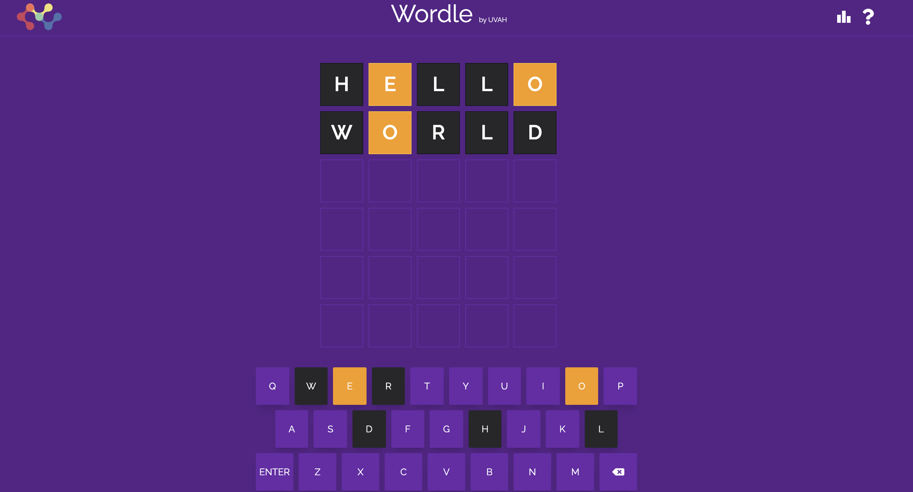

# Wordle



CodeSandbox Link: https://codesandbox.io/s/elegant-bardeen-ojdwp7
## Development

From your terminal:

```sh
npm run dev
```

This starts your app in development mode, rebuilding assets on file changes.

## Deployment

First, build your app for production:

```sh
npm run build
```

Then run the app in production mode:

```sh
npm start
```

or

```sh
# using pm2
pm2 start npm -- start
```

Now you'll need to pick a host to deploy it to.
